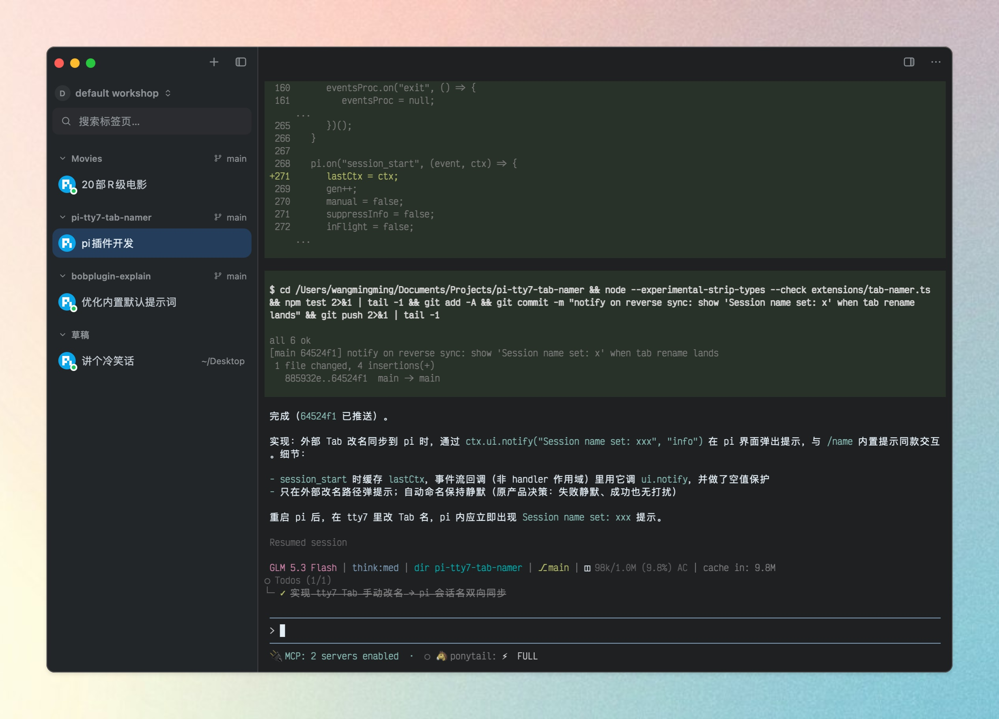

<p align="center">
  
</p>

<h1 align="center">pi-tty7-tab-namer</h1>

<p align="center">
  <strong>pi 扩展</strong> · 用大模型自动为会话命名，同步到 <a href="https://github.com/l0ng-ai/tty7">tty7</a> 的 Tab 标题<br>
</p>

<p align="center">
  <a href="./LICENSE"></a>
  
  
</p>

## 安装

前提：在 [tty7](https://github.com/l0ng-ai/tty7) 终端内运行 pi（本扩展只在 tty7 环境下激活）。

```bash
pi install git:github.com/ifyour/pi-tty7-tab-namer
```

装好即可，无需任何操作。名字会同步写入会话元数据，`/resume` 会话列表里也直接可读。

## 使用场景

| 场景 | 行为 |
|---|---|
| 新会话发出第一条消息 | Tab 自动显示 ≤10 字中文标题 |
| 载入未命名的历史会话 | 基于最近 10 条消息为**整个会话**命名，而不只看追加的新消息 |
| `/name 自定义` | Tab 立即更新，且之后自动命名不再生效 |
| 在 tty7 里手动改 Tab 名 | 会话名立即同步为该名字，之后自动命名不再生效（等同 `/name`） |
| resume 已命名会话 | Tab 立即显示该名字 |
| 退出 pi | Tab 回落到 tty7 默认标题 |

## 特性

- **自动命名**：第一条消息发出时，并行调用当前会话模型总结意图生成标题，不阻塞对话
- **双向同步**：tty7 手动改 Tab 名 → 写入 pi 会话名；pi 内命名 → 更新 Tab
- **手动优先**：`/name` 或 tty7 手动改名后，自动命名永不覆盖
- **全生命周期跟随**：`new` / `resume` / `fork` / `quit` 时 Tab 标题跟随会话名字
- **竞态安全**：命名请求在途时切换/退出会话，结果被丢弃，不会写错会话；20 秒超时，失败后下一轮自动重试
- **子代理隔离**：主会话派发 subagent（pi-subagents）时，子会话不会碰 Tab 标题或会话名，主会话命名不受影响

## FAQ

**在其他终端（iTerm2 等）能用吗？**

目前不能，本扩展仅针对 tty7。

**支持多轮后自动改名吗？**

目前一个会话只命名一次（手动除外）。

**模型调用花钱吗？**

每次命名一个极小请求（约几百 token），仅在未命名会话首次触发时发生。

## 开发

```bash
git clone https://github.com/ifyour/pi-tty7-tab-namer
cd pi-tty7-tab-namer
npm test          # 标题清洗逻辑自检
pi -e .           # 本地试用
```

## License

MIT
