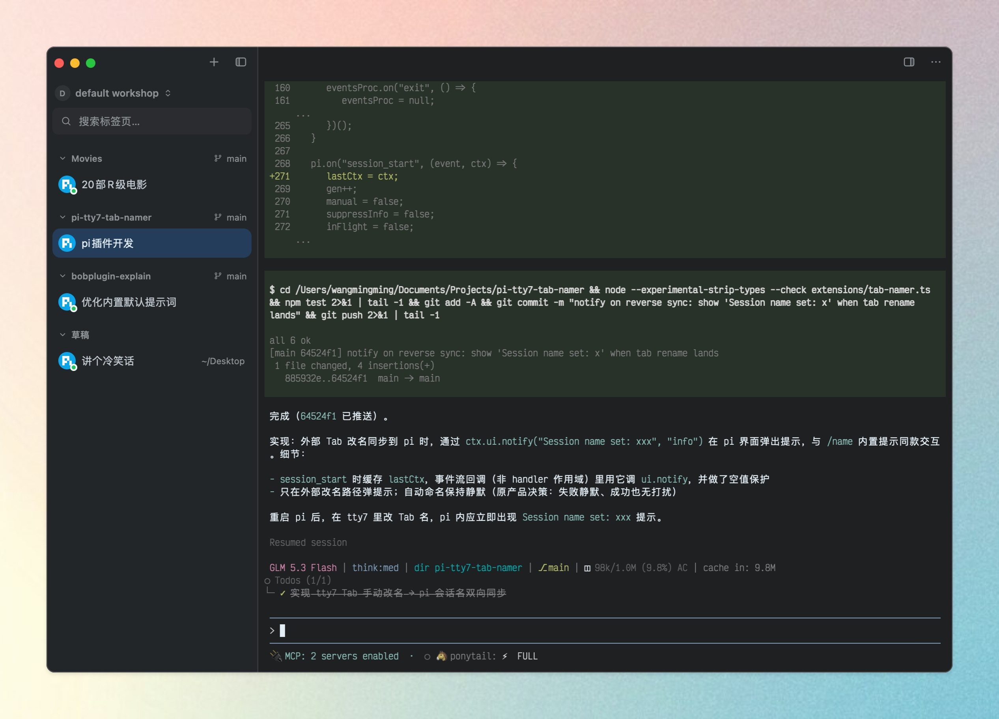

<p align="center">
  
</p>

<h1 align="center">pi-tty7-tab-namer</h1>

<p align="center">
  <strong>pi extension</strong> · names sessions automatically with an LLM, synced to <a href="https://github.com/l0ng-ai/tty7">tty7</a> tab titles<br>
</p>

<p align="center">
  <a href="./LICENSE"></a>
  
  
</p>

<p align="center">
  <sub>English · <a href="README.zh-CN.md">简体中文</a></sub>
</p>

## Install

Prerequisite: run pi inside the [tty7](https://github.com/l0ng-ai/tty7) terminal (this extension only activates in a tty7 environment).

```bash
pi install git:github.com/ifyour/pi-tty7-tab-namer
```

That's it — nothing else to do. Names are also written to session metadata, so they show up readable in the `/resume` session list.

## Usage

| Scenario | Behavior |
|---|---|
| First message in a new session | Tab automatically shows a short (≤10 char) title |
| Loading an unnamed historical session | Names the **whole session** from the last 10 messages, not just the newly appended one |
| `/name custom` | Tab updates immediately, and auto-naming stops for that session |
| Manually renaming the tab in tty7 | Session name syncs immediately, and auto-naming stops (same as `/name`) |
| Resuming a named session | Tab shows the name immediately |
| Quitting pi | Tab falls back to the default tty7 title |

## Features

- **Auto-naming**: on the first message, calls the current session model in parallel to summarize intent into a title, without blocking the conversation
- **Two-way sync**: manual tab rename in tty7 → writes the pi session name; naming inside pi → updates the tab
- **Manual wins**: after `/name` or a manual tty7 rename, auto-naming never overrides
- **Full lifecycle**: tab title follows the session name on `new` / `resume` / `fork` / `quit`
- **Race-safe**: switching or quitting while a naming request is in flight discards the result, never writing to the wrong session; 20s timeout with automatic retry on the next turn
- **Subagent isolation**: when the main session spawns subagents, child sessions never touch the tab title or session name (compatible with all pi sub-session mechanisms, e.g. pi-subagents and the built-in Task tool)

## FAQ

**Does it work in other terminals (iTerm2, etc.)?**

Not currently — this extension targets tty7 only.

**Does it auto-rename after multiple turns?**

A session is named once (unless done manually).

**Does the model call cost money?**

Each naming run is one tiny request (a few hundred tokens), triggered only the first time for an unnamed session.

## Development

```bash
git clone https://github.com/ifyour/pi-tty7-tab-namer
cd pi-tty7-tab-namer
npm test          # self-check for title sanitization logic
pi -e .           # try locally
```

## License

MIT
